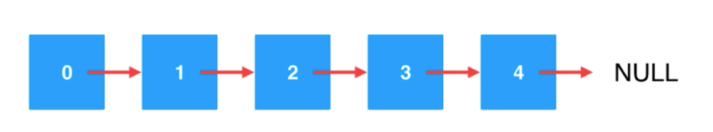

# 链表

### 概述

`链表`是真正的动态数据结构，内存不再是连续的空间，不需要处理固定容量的问题。

数据存储在“节点”(Node)中，节点中包含下一个节点来进行连接。

```java
class Node {
	E e;
	Node next;
}
```

当下一个节点为空时，链表就到达结尾了。



### 优缺点

#### 优点

真正的动态，不需要处理固定容量的问题。

#### 缺点

丧失了随机访问的能力。