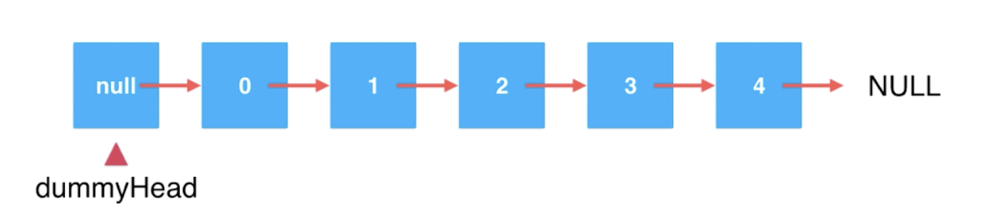

# 【二】链表-添加元素

### 链表头添加元素

在链表头添加元素，只需要把待添加元素的next指向head，同时维护head向前移动即可。

```java
/**
 * 在链表头添加新的元素
 *
 * @param e 添加的元素
 */
public void addFirst(E e) {
    Node<E> node = new Node<>(e);
    node.next = head;
    head = node;

    size ++;
}
```

整个个构建过程的简易写法：

```java
/**
 * 在链表头添加新的元素
 *
 * @param e 添加的元素
 */
public void addFirst(E e) {
//    Node<E> node = new Node<>(e);
//    node.next = head;
//    head = node;

    //简易写法
    head = new Node<>(e, head);

    size ++;
}
```

### 链表中间添加元素

> 链表中理论上不存在索引的说法，为方便我们练习使用，引入索引的概念，也是从0开始。

在链表中间添加元素，需要先找到待添加位置的前一个节点`prev`，再将待添加的节点`node.next`指向`prev.next`，最后将`prev.next`指向`node`。

当索引为0时，表示在链表头添加元素，它不存在`prev`，需要特殊处理。

```java
/**
 * 在链表index(0-based)位置添加新的元素e
 * 在链表中理论上不存在索引，练习使用
 *
 * @param index 链表位置
 * @param e     待添加元素
 */
public void add(int index, E e) {
    if (index < 0 || index > size) {
        throw new IllegalArgumentException("index is invalid");
    }

    //在表头添加元素
    if (index == 0) {
        addFirst(e);
    } else {
        //找到待添加位置的前一个节点
        Node prev = head;
        for (int i = 0; i < index - 1; i++) {
            prev = prev.next;
        }
        
        //待添加的节点
//        Node<E> node = new Node<>(e);
//        node.next = prev.next;
//        prev.next = node;
      
        prev.next = new Node<>(e,prev.next);
    }

    size++;
}
```

### 链表尾添加元素

在链表尾添加元素，只需要调用`add(int index, E e)`，此时`index`为size就是链表末尾

```java
/**
 * 在链表末尾添加元素e
 *
 * @param e 待添加的元素e
 */
public void addLast(E e) {
    add(size, e);
}
```

### 虚拟头结点

在添加过程中，由于在链表头添加元素，它前面没有节点，所以需要特殊处理。

在链表的操作中，可以通过添加一个`空节点`作为链表的头结点使用，我们通常称为`虚拟头结点(dummyHead)`，那么链表的第一个元素就是`dummyHead.next`。



```java
class LinkedList<E> {

    //虚拟头节点
    private Node<E> dummyHead;

    /**
     * 构造方法，初始化一个节点作为虚拟头结点
     */
    public LinkedList() {
        dummyHead = new Node<>();
    }

    //链表中元素个数
    private int size;

    /**
     * 获取链表中元素个数
     *
     * @return 元素个数
     */
    public int getSize() {
        return size;
    }

    /**
     * 链表是否为空
     *
     * @return 是否为空
     */
    public boolean isEmpty() {
        return size == 0;
    }


    /**
     * 在链表index(0-based)位置添加新的元素e
     * 在链表中理论上不存在索引，练习使用
     *
     * @param index 链表位置
     * @param e     待添加元素
     */
    public void add(int index, E e) {
        if (index < 0 || index > size) {
            throw new IllegalArgumentException("index is invalid");
        }

        //找到待添加位置的前一个节点
        Node prev = dummyHead;
        for (int i = 0; i < index; i++) {
            prev = prev.next;
        }

        prev.next = new Node<>(e, prev.next);

        size++;
    }

    /**
     * 在链表头添加新的元素
     *
     * @param e 添加的元素
     */
    public void addFirst(E e) {
        add(0, e);
    }
    
    /**
     * 在链表末尾添加元素e
     *
     * @param e 待添加的元素e
     */
    public void addLast(E e) {
        add(size, e);
    }

    @Override
    public String toString() {
        StringBuilder builder = new StringBuilder();
        Node node = dummyHead.next;
        while (node != null) {
            builder.append(node.e).append("->");
            node = node.next;
        }
        builder.append("NULL");
        return builder.toString();
    }
}
```

