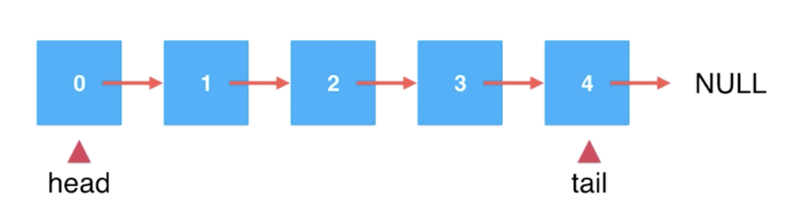

# 【八】链表实现队列

### 概述

由于队列需要在数据的一端添加元素，另一端删除元素，之前的链表就不能满足这样的需求。

所以我们需要改进链表，同时维护头和尾的节点。



在同时维护了头节点和尾节点后，添加元素，都是O(1)的复杂度。

但是，如果在tail删除元素，需要找到前一个节点，又变成了O(n)的复杂度，所以我们使用head端添加删除节点，作为队首。

tail -> 队尾，添加元素；

head -> 队首，取出元素。

### 实现

```java
class LinkedListQueue<E> implements Queue<E> {

    //同时维护头尾指针，可以在tail添加元素，head删除元素
    private Node<E> head, tail;

    private int size;

    @Override
    public void enqueue(E e) {
        //链表为空
        if (head == null) {
            head = new Node<>(e);
            tail = head;
        } else {
            tail.next = new Node<>(e);
            tail = tail.next;
        }

        size++;
    }

    @Override
    public E dequeue() {
        if (isEmpty()) {
            throw new IllegalArgumentException("Cannot dequeue from an empty queue");
        }

        Node retNode = head;
        head = head.next;
        retNode.next = null;
        //只有一节点时
        if (head == null) {
            tail = null;
        }

        size--;
        return (E) retNode.e;
    }

    @Override
    public E getFront() {
        if (isEmpty()) {
            throw new IllegalArgumentException("Cannot get from an empty queue");
        }
        return head.e;
    }

    @Override
    public int getSize() {
        return size;
    }

    @Override
    public boolean isEmpty() {
        return size == 0;
    }

    @Override
    public String toString() {
        StringBuilder builder = new StringBuilder();
        builder.append("Queue: ");
        builder.append("front ");
        Node node = head;
        while (node != null) {
            builder.append(node.e).append("->");
            node = node.next;
        }
        builder.append("NULL tail");
        return builder.toString();
    }
}
```


