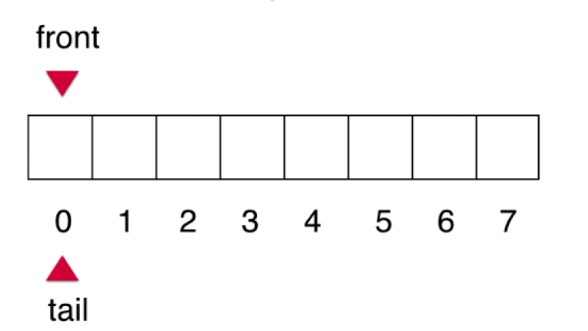
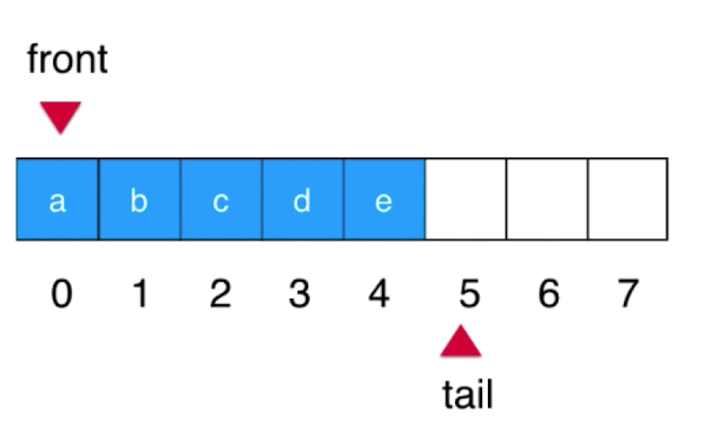

# 【三】循环队列

### 概述

`数组队列`存在一定的局限性，由于取出第一个元素，后面元素都要向前移动，`出队`操作时时间复杂度为`O(n)`。

如果`出队`不再维护所有元素移动，只是队首指向变成下一个元素，那么时间复杂度就变为了`O(1)`。

### 原理

同时维护队首索引**(front)**和队尾索引**(tail)**，`front`表示第一个元素的位置，`tail`表示下一个元素的位置。

* 队列为空

  当`front == tail`时，队列为空。

  

* 元素入队

  front指向第一个元素，tail向后移动，指向下一个元素位置。

  

* 元素出队

  front指向向后移动，其它元素不用移动。

  

* 队列成环

  当tail向后移动到达最后，前面可能还会存在已经移出队列的空间可以使用，tail可以使用这些空间，形成`环状`。

  计算tail位置的算法：`(tail + 1) % length`，length是数组的长度。

  

* 队列满

  当上图tail移动到2时，队列就满了，但此时front == tail，也表示队列为空。为了区别，定义 `(tail + 1) % length == front`时队列满，即浪费一个空间来表示队列已满。

  

### 代码实现

```java
class LoopQueue<E> implements Queue<E> {

    private E[] data;

    //队首和队尾（下一个元素）的位置
    private int front, tail;

    private int size;

    public LoopQueue(int capacity) {
        //有意浪费掉一个空间
        data = (E[]) new Object[capacity + 1];
    }

    public LoopQueue() {
        this(10);
    }

    @Override
    public void enqueue(E e) {
        //队列已满
        if ((tail + 1) % data.length == front) {
            //扩容，之前容量2倍
            resize(getCapacity() * 2);
        }

        data[tail] = e;
        tail = (tail + 1) % data.length;
        size++;
    }

    /**
     * 扩容，浪费一个空间
     *
     * @param newCapacity 新的容量
     */
    private void resize(int newCapacity) {
        E[] newData = (E[]) new Object[newCapacity + 1];
        for (int i = 0; i < size; i++) {
            //循环队列偏移
            newData[i] = data[(i + front) % data.length];
        }

        data = newData;

        //更新队首和队尾
        front = 0;
        tail = size;
    }

    @Override
    public E dequeue() {
        if (isEmpty()) {
            throw new IllegalArgumentException("Cannot dequeue from an empty queue.");
        }

        //取出队首元素
        E ret = data[front];
        data[front] = null;
        //移动队首指向
        front = (front + 1) % data.length;
        //维护元素个数
        size--;

        //缩容
        if (size == getCapacity() / 4 && getCapacity() / 2 != 0) {
            resize(getCapacity() / 2);
        }
        return ret;
    }

    @Override
    public E getFront() {
        if (isEmpty()) {
            throw new IllegalArgumentException("Queue is Empty");
        }
        return data[front];
    }

    @Override
    public int getSize() {
        return size;
    }

    @Override
    public boolean isEmpty() {
        return front == tail;
    }

    /**
     * 返回队列容量
     *
     * @return 队列容量
     */
    public int getCapacity() {
        return data.length - 1;
    }

    @Override
    public String toString() {
        StringBuilder builder = new StringBuilder();
        builder.append(String.format("Queue: size = %d , capacity = %d\n", size, getCapacity()));
        builder.append("front [");
      	//从队首到队尾的循环
        for (int i = front; i != tail; i = (i + 1) % data.length) {
            builder.append(data[i]);
            if ((i + 1) % data.length != tail) {
                builder.append(", ");
            }
        }
        builder.append("] tail");

        return builder.toString();
    }
}
```

**重点在于维护front和tail，以及循环队列偏移计算。**

### 复杂度分析

| 循环队列            | 时间复杂度 |
| ------------------- | ---------- |
| `void enqueue(E e)` | O(1)       |
| `E dequeue()`       | **O(1)**   |
| `E getFront()`      | O(1)       |
| `int getSize()`     | O(1)       |
| `boolean isEmpty()` | O(1)       |

